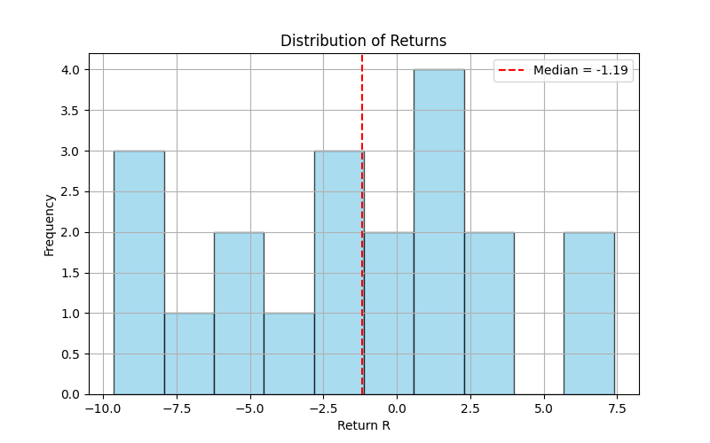
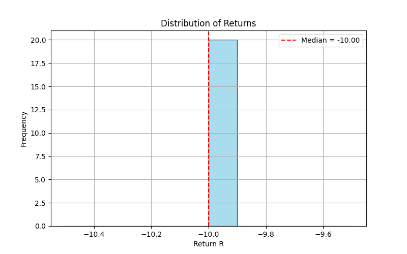

# Project Title
Discretized_state_space
<br>
This project explores the concept of discretized state spaces in reinforcement learning through two classic control problems — the inverted pendulum and the car in the mountains.

# Project Structure
```
project/
│── car_in_the_mountains_solver.py
│── discretized_state_space.py
│── pendulum_solver.py
│── README.md
│── run_episode.py
│── value_iteration_policy.py
```

# How It Works
- car_in_the_mountains_solver.py:
    This file creates the continues space, range of P and V, Transition function, Reward function of Car in Mountain problem.
    You can run this file which gives the optimal Value and the optimal policy of this problem by using Value iteration method.

- discretized_state_space.py:
    This file creates a rectangle discretized space by the range of P and V of a problem and also the number of grids, it returns the P bins and V bins and a dictionary of grid
    which the key is a cell id and the value is the 4 corner of the cell by P and V continues.
    <br>
    There are two other functions find_cell and find_p_v to convert the cell_id to p and v or on the contrary. Transforming continuous values to discretized values and on the contrary.

- pendulum_solver.py:
    This file creates the continues space, range of P and V, Transition function, Reward function of Pendulum problem.
    You can run this file which gives the optimal Value and the optimal policy of this problem by using Value iteration method.

- run_episode.py:
    This file execute the trajectory of a continuous problem with an optimal policy calculated by gridy policy in value_iteration method; 20 times and storing the R value of each execution. 
    <br>
    At the end, it returns the median R from the 20 executions and plot the variablity of all twenty R values.

- value_iteration_policy.py:
    This is a file to calculate the optimal policy by value_iteration method (gridy policy) for a continouos problem. In this file every time the transformation of continuous Position and Velocity or on the contrary is calculated.

**Note 1: run_episode.py, value_iteration_policy.py and discretized_state_space.py are all generic and can be used for any continous problem, just before using them you should define the continuous problem in another file.py and be imported in run_episode.py or give their transition and reward function to value_iteration_policy.py**

**Note 2: To use for other continuous problem check pendulum_solver.py to see how I used value_iteration_policy.py or run_episode.py for this problem**

# Installation
- git clone https://github.com/sana-mirahsani/Discretized_state_space
- cd project

# Usage
python run_episode.py

**Note 3: There are two problems in run_episode.py, pendulum and car in mountain; to run each of these problems, make one of them as comment in the main function and uncomment the other one to see the Plot of lists of Return values in 20 execution and the Median return value.**

# Results:
## Result of R Median and R values in 20 execution for Pendulum problem: 



## Result of R Median and R values in 20 execution for Car in Mountain problem: 



**Note 4: Try to add other results of other continuous problems**

# Contributing
Contributions are welcome! If you would like to improve this project, please follow the guidelines below:

- Pull Requests:
    Fork the repository and create your feature branch.

- Code Style:
    - Follow the existing coding style and conventions of the project.

    - Use meaningful variable and function names.

    - Format code using tools such as black, flake8, or prettier (depending on the language).

    - Add comments for complex logic and document functions if needed.

# License

MIT, Apache, GNU, or other.

# Contact
Author name: Sana Mirahsani
email: s.mirahsani1998@gmail.com
LinkedIn: sana_mirahsani
GitHub: sana_mirahsani