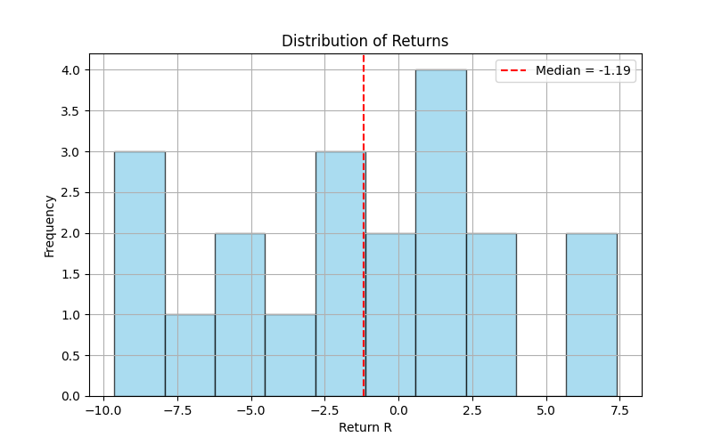
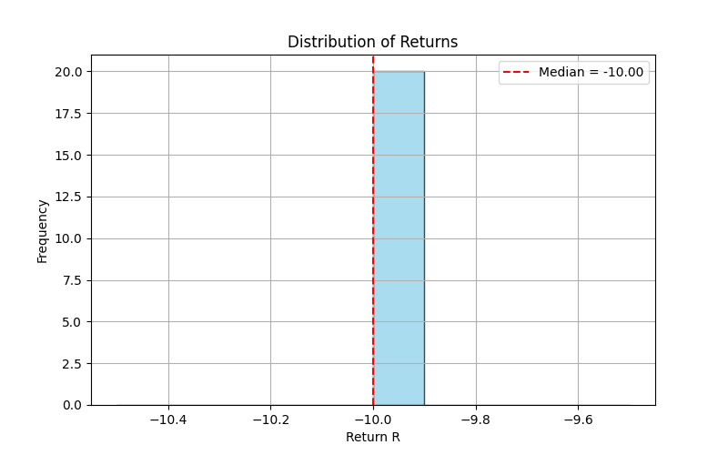

# 🚀 Discretized State Space in Reinforcement Learning


## 📌 Description

Welcome to the **Discretized State Space** project!

This project explores how **continuous state spaces** can be transformed into **discrete representations** for reinforcement learning. It demonstrates this concept using two classic control problems:

* 🎯 Inverted Pendulum
* 🚗 Car in the Mountains

The project shows how discretization enables applying **Value Iteration** and computing optimal policies in continuous environments.

---

## 📂 Project Structure

```bash
project/
│
├── car_in_the_mountains_solver.py
├── discretized_state_space.py
├── pendulum_solver.py
├── run_episode.py
├── value_iteration_policy.py
├── README.md
```

| File                             | Description                                                                                   |
| -------------------------------- | --------------------------------------------------------------------------------------------- |
| `car_in_the_mountains_solver.py` | Defines the continuous space, transition, and reward functions for the mountain car problem   |
| `discretized_state_space.py`     | Creates discretized grid space and handles conversions between continuous and discrete states |
| `pendulum_solver.py`             | Defines the pendulum environment and solves it using value iteration                          |
| `run_episode.py`                 | Runs multiple simulations and evaluates policy performance                                    |
| `value_iteration_policy.py`      | Computes optimal policy using value iteration on discretized space                            |

---

## ✨ Features

### 🔹 Discretized State Space

* Converts continuous variables (Position, Velocity) into discrete grids

* Generates:

  * Grid cells
  * Bin boundaries
  * Mapping between continuous ↔ discrete states

* Utility functions:

  * `find_cell` → continuous → discrete
  * `find_p_v` → discrete → continuous

---

### 🔹 Reinforcement Learning Solvers

#### 🚗 Car in the Mountains

* Continuous state space modeling
* Transition & reward functions
* Optimal policy via Value Iteration

#### 🎯 Inverted Pendulum

* Physics-based continuous environment
* Solved using discretization + Value Iteration

---

### 🔹 Value Iteration

* Grid-based policy computation
* Handles continuous → discrete transformations internally
* Generic implementation usable for other problems

---

### 🔹 Episode Simulation

* Run **20 trajectories** using optimal policy
* Compute:

  * 📊 Return values
  * 📈 Median return
  * 📉 Variability visualization

---

## ⚙️ Requirements

* Python 3.x
* NumPy
* Matplotlib

Install dependencies:

```bash
pip install numpy matplotlib
```

---

## ▶️ How to Use

### 1. Clone the repository

```bash
git clone https://github.com/sana-mirahsani/Discretized_state_space
cd Discretized_state_space
```

### 2. Run simulation

```bash
python run_episode.py
```

### ⚠️ Notes

* Two problems are included:

  * Pendulum
  * Car in the Mountains

👉 To run one:

* Comment one problem in `run_episode.py`
* Uncomment the other

---

## 📊 Results

### 🎯 Pendulum Problem

* Median return over 20 runs
* Variability of returns



---

### 🚗 Car in the Mountains

* Median return over 20 runs
* Variability of returns



---

## 💡 Additional Notes

* `run_episode.py`, `value_iteration_policy.py`, and `discretized_state_space.py` are **generic**
* You can reuse them for **any continuous control problem**

👉 To extend:

* Define a new environment (transition + reward)
* Plug it into the existing framework

---

## 🤝 Contributing

Contributions are welcome!

### 🔹 How to Contribute

* Fork the repository
* Create a feature branch
* Submit a pull request

### 🔹 Code Guidelines

* Follow existing coding style
* Use meaningful variable names
* Add comments for complex logic
* Format code using:

  * `black`
  * `flake8`

---

## 📜 License

This project is licensed under the **MIT License** (or similar).

---

## 👩‍💻 Author

**Sana Mirahsani**
📧 [s.mirahsani1998@gmail.com](mailto:s.mirahsani1998@gmail.com)
🔗 LinkedIn: sana-mirahsani
💻 GitHub: sana-mirahsani

---

## ⭐ Support

If you find this project useful:

* ⭐ Star the repo
* 🍴 Fork it
* 🚀 Use it in your RL projects